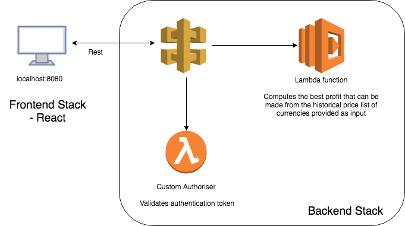

# NAB Coding Challenge
Analyzes crypto currencies data and process the price list provided to return the best profit that can be made by buying a currency at a given rate and then later selling it.

## Tech stack
### Frontend Stack
* [React](https://github.com/facebook/react) & [React Router 4](https://github.com/ReactTraining/react-router)
* [Node](https://github.com/nodejs) & [Express](https://github.com/expressjs/express)

### Backend Stack
* [Node](https://github.com/nodejs)
* [Serverless Framework](https://serverless.com/)
* AWS Lambda and API Gateway
* [JEST](https://jestjs.io/)
* [Eslint](https://eslint.org/)

## Architecture Diagram

* Please refer to README files within backend-stack and frontend-stack to setup and execute program and tests